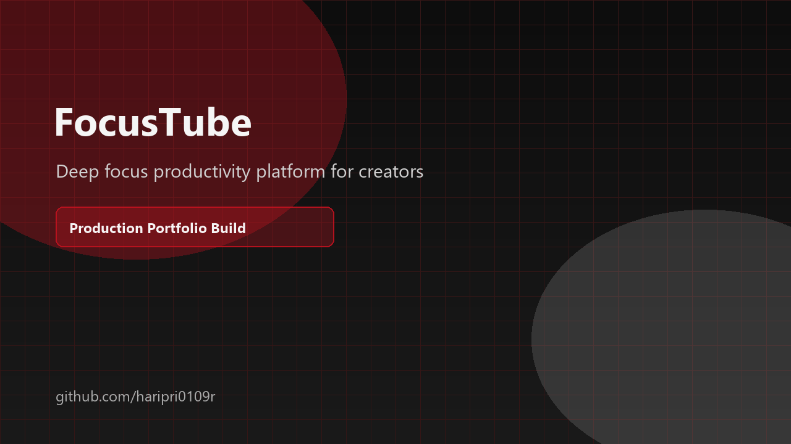
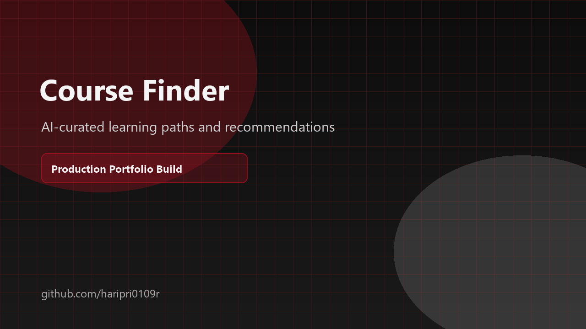
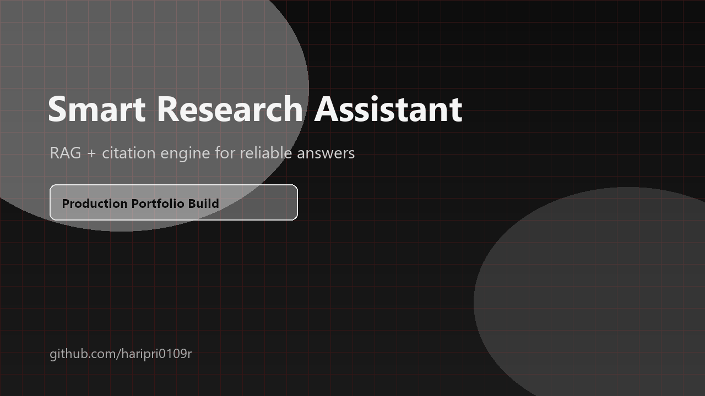
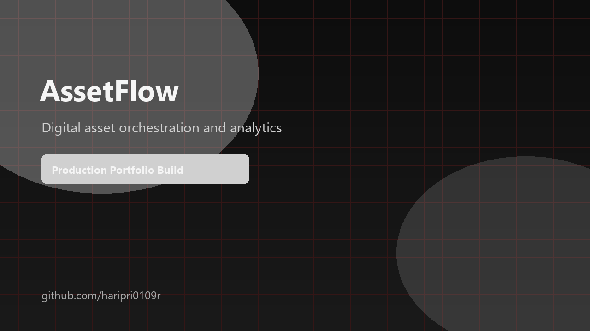
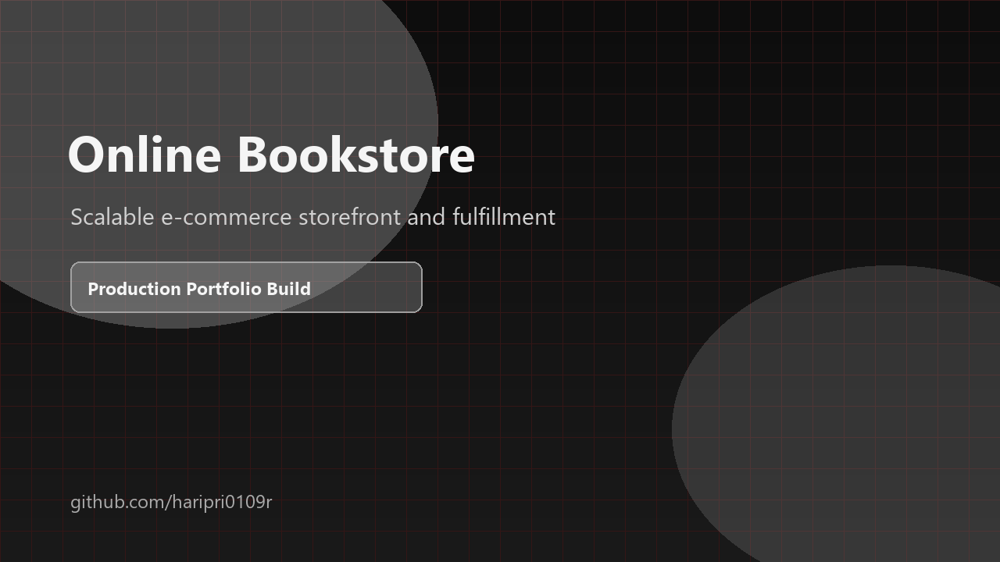
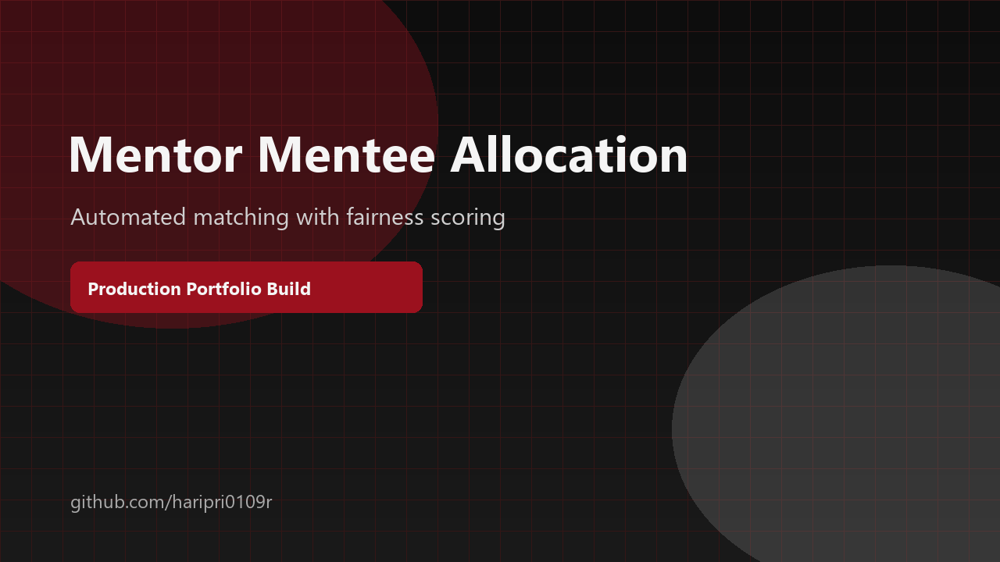
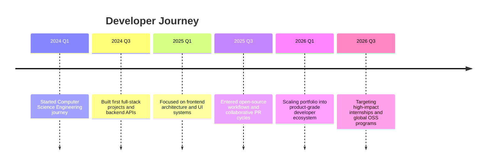
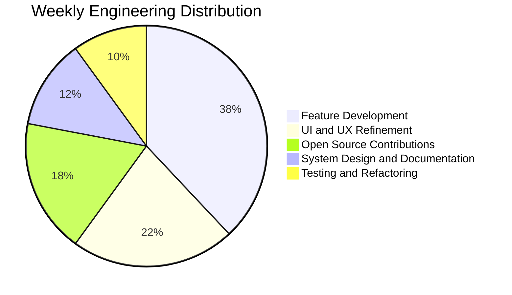

# Haripriyan | Premium GitHub Profile

  

  

  
  
  
  

  
  
  

<h2 align="center">Hero Section</h2>

  I build product-grade applications with polished UX, scalable backend systems, and measurable business outcomes.
  My focus is shipping useful software fast without compromising code quality.

<table align="center" width="100%">
<tr>
<td width="50%" valign="top">

### About Me
- Full-stack engineer focused on React, TypeScript, Node.js, and Python.
- Contributor in open source programs including GSSoC.
- Experienced in frontend architecture, API design, and AI-powered workflows.
- Interested in internship opportunities and collaborative OSS work.

</td>
<td width="50%" valign="top">

### Current Focus
- Shipping FocusTube and AssetFlow as portfolio-grade products.
- Building practical AI integration patterns for developer tooling.
- Improving architecture clarity through reusable design systems.
- Strengthening benchmarking, testing, and release discipline.

</td>
</tr>
</table>

<h2 align="center">Tech Universe</h2>

<table width="100%">
<tr>
<td valign="top" width="33%">

### Frontend

  

</td>
<td valign="top" width="33%">

### Backend and Data

  

</td>
<td valign="top" width="33%">

### Tooling and Cloud

  

</td>
</tr>
</table>

<h2 align="center">GitHub Dashboard</h2>

  
  

  
  

  

  

  

  

<h2 align="center">Contribution Snake</h2>

  

<h2 align="center">Featured Projects</h2>

<table width="100%">
<tr>
<td width="50%" valign="top">

### FocusTube

Status: 

Tech Stack: React, TypeScript, Vite, Chrome Extension APIs, Node.js

Key Features:
- Distraction-free YouTube interface
- Smart filtering for learning sessions
- Session analytics for focus tracking

Links:
- GitHub: https://github.com/haripri0109r?tab=repositories&q=focustube
- Demo: https://github.com/haripri0109r/haripri0109r/blob/main/assets/projects/focustube.png
- Documentation: https://github.com/haripri0109r/haripri0109r/blob/main/assets/architecture/focustube.svg

</td>
<td width="50%" valign="top">

### Course Finder

Status: 

Tech Stack: Next.js, TypeScript, Node.js, PostgreSQL, Recommendation Logic

Key Features:
- Curated course search
- Personalized recommendation scoring
- Structured roadmap output

Links:
- GitHub: https://github.com/haripri0109r?tab=repositories&q=course
- Demo: https://github.com/haripri0109r/haripri0109r/blob/main/assets/projects/coursefinder.png
- Documentation: https://github.com/haripri0109r/haripri0109r/blob/main/assets/architecture/coursefinder.svg

</td>
</tr>
<tr>
<td width="50%" valign="top">

### Smart Research Assistant

Status: 

Tech Stack: Python, LLM APIs, Vector Search, FastAPI, Retrieval Pipelines

Key Features:
- Context-aware research retrieval
- Citation-backed response generation
- Evidence and source traceability

Links:
- GitHub: https://github.com/haripri0109r?tab=repositories&q=assistant
- Demo: https://github.com/haripri0109r/haripri0109r/blob/main/assets/projects/researchassistant.png
- Documentation: https://github.com/haripri0109r/haripri0109r/blob/main/assets/architecture/assistant.svg

</td>
<td width="50%" valign="top">

### AssetFlow

Status: 

Tech Stack: MERN, RBAC, Workflow Automation, Analytics Dashboard

Key Features:
- Role-based access and governance
- Asset lifecycle and booking management
- Operational reporting for resource allocation

Links:
- GitHub: https://github.com/haripri0109r?tab=repositories&q=assetflow
- Demo: https://github.com/haripri0109r/haripri0109r/blob/main/assets/projects/assetflow.png
- Documentation: https://github.com/haripri0109r/haripri0109r/blob/main/assets/projects/assetflow.png

</td>
</tr>
<tr>
<td width="50%" valign="top">

### Online Bookstore

Status: 

Tech Stack: React, Node.js, Express, MongoDB, Payment Flow Design

Key Features:
- Catalog, cart, and checkout pipeline
- Inventory and order management
- Customer-friendly browsing UX

Links:
- GitHub: https://github.com/haripri0109r?tab=repositories&q=bookstore
- Demo: https://github.com/haripri0109r/haripri0109r/blob/main/assets/projects/onlinebookstore.png
- Documentation: https://github.com/haripri0109r/haripri0109r/blob/main/assets/projects/onlinebookstore.png

</td>
<td width="50%" valign="top">

### Mentor Mentee Allocation System

Status: 

Tech Stack: Python, Matching Algorithms, SQL, Admin Workflow Dashboard

Key Features:
- Fairness-aware mentor assignment
- Constraint-based matching rules
- Allocation analytics and reports

Links:
- GitHub: https://github.com/haripri0109r?tab=repositories&q=mentor
- Demo: https://github.com/haripri0109r/haripri0109r/blob/main/assets/projects/mentormentee.png
- Documentation: https://github.com/haripri0109r/haripri0109r/blob/main/assets/projects/mentormentee.png

</td>
</tr>
</table>

<h2 align="center">Open Source Dashboard</h2>

  
  
  
  

<table width="100%">
<tr>
<td width="50%" valign="top">

### Pull Request Style
- Scoped, reviewable commits
- Clear test notes with behavior summary
- Change logs designed for maintainers

</td>
<td width="50%" valign="top">

### Community Participation
- OSS collaboration through issue triage
- Hands-on fixes in active repositories
- Maintainer-friendly communication style

</td>
</tr>
</table>

<h2 align="center">Achievements and Certifications</h2>

<table width="100%">
<tr>
<td width="50%" valign="top">

### Certifications and Learning
- Full-stack and AI-focused engineering track
- Continuous learning in system design and architecture

### Hackathons
- CodeLee Winner
- Freshathon Winner

</td>
<td width="50%" valign="top">

### GitHub and Open Source
- GSSoC contributor with merged pull requests
- Sustained open-source participation and code quality focus

### Problem Solving
- LeetCode rating: 1767
- 280+ DSA problems solved

</td>
</tr>
</table>

<h2 align="center">Developer Journey Timeline</h2>

<h2 align="center">Current Focus</h2>

- Building reusable frontend patterns with clean motion and consistent UX.
- Improving backend reliability through better observability and testing.
- Converting project work into high-signal open-source contributions.
- Documenting architecture clearly for maintainability and onboarding.

<h2 align="center">2026 Roadmap</h2>

- Q3: Publish production-ready versions of FocusTube and AssetFlow.
- Q3: Increase OSS velocity with deeper multi-repo contributions.
- Q4: Strengthen system design portfolio with scale-focused case studies.
- Q4: Deliver interview-ready engineering writeups and architecture docs.
- Q4: Expand mentorship and community collaboration footprint.

<h2 align="center">Weekly Development Breakdown</h2>

<h2 align="center">Developer Philosophy</h2>

> Build for users first, optimize for maintainers second, and automate everything repetitive.

- Clean architecture beats clever shortcuts.
- Developer experience is a product feature.
- Measurable outcomes are better than aesthetic-only demos.
- Strong documentation multiplies team velocity.

<h2 align="center">Contact</h2>

  
  
  

  Available for internships, open-source collaboration, and impactful product engineering.

<h2 align="center">Premium Footer</h2>

  

  <strong>Designed and engineered by Haripriyan</strong> 
  Full-stack engineering, open-source collaboration, and product-focused execution.

