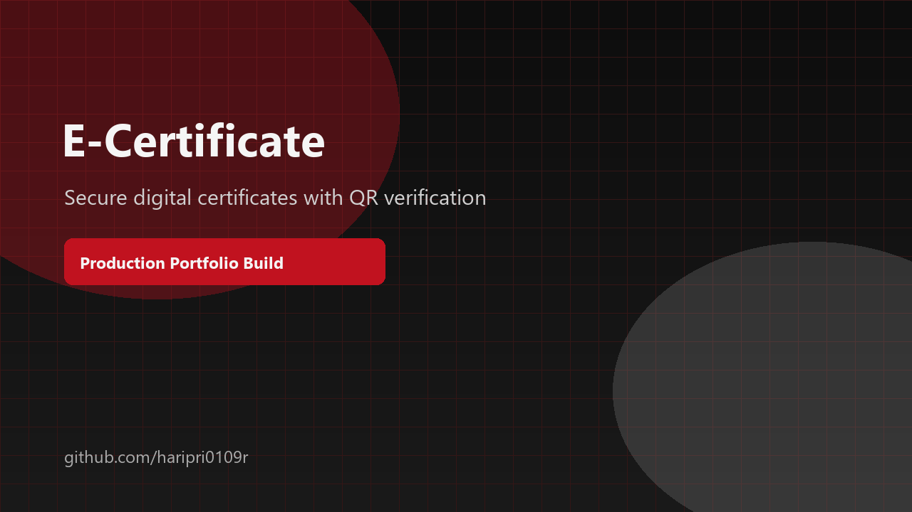

# Haripriyan | Premium GitHub Profile

  

  

  
  
  
  
  
  

  
  
  

  <picture>
    <source media="(prefers-color-scheme: dark)" srcset="https://raw.githubusercontent.com/haripri0109r/haripri0109r/output/dist/github-contribution-grid-snake-dark.svg">
    <source media="(prefers-color-scheme: light)" srcset="https://raw.githubusercontent.com/haripri0109r/haripri0109r/output/dist/github-contribution-grid-snake.svg">
    
  </picture>

---

## Hero

I build product-focused software with careful UI, maintainable architecture, and clean execution.
My profile is intentionally minimal, premium, and grounded in real work rather than inflated claims.

## About Me

<table width="100%">
<tr>
<td width="55%" valign="top">

I am a full-stack developer who enjoys turning ideas into polished, useful products. I care about responsive UI, stable backend flows, and code that remains understandable after the first build.

</td>
<td width="45%" valign="top">

**Current focus**
- Building real portfolio projects
- Improving UI quality and maintainability
- Contributing to open source where it fits my skills
- Keeping my profile truthful and lightweight

</td>
</tr>
</table>

## Tech Stack

### Frontend

  
  
  
  

### Backend

  
  
  

### Database

  
  

### Artificial Intelligence

  
  
  

### Languages

  
  
  

### Tools

  
  
  
  

## Featured Projects

<table width="100%">
<tr>
<td width="50%" valign="top">

### FocusTube

**Tech Stack:** React, TypeScript, Plasmo, Chrome Extension API, IndexedDB, Tailwind CSS

**Features**
- YouTube productivity and focus filtering
- Shorts blocking and educational prioritization
- Persistent local preferences for distraction control

</td>
<td width="50%" valign="top">

### Course Finder

**Tech Stack:** MongoDB, Express.js, React Native, Node.js, JavaScript, Firebase

**Features**
- Course discovery and progress tracking
- Personalized recommendations
- Notification-driven learning flow

</td>
</tr>
<tr>
<td width="50%" valign="top">

### Smart Research Assistant

**Tech Stack:** FastAPI, React.js, SQLite, ChromaDB, Ollama, Qwen2.5, BGE Embeddings, OpenAlex API

**Features**
- Paper discovery and summarization
- Document-grounded chat and comparison
- PDF and DOCX export with research tracking

</td>
<td width="50%" valign="top">

### E-Certificate Generation & Verification System

**Tech Stack:** Spring Boot, React, MySQL, JWT, REST API

**Features**
- Digital certificate generation and issuance
- QR-based verification with unique certificate IDs
- Role-based access and authenticity checks

</td>
</tr>
</table>

## Open Source

<table width="100%">
<tr>
<td width="50%" valign="top">

I have participated in GSSoC and contributed to open source through PRs, issue work, and community collaboration. My current public work includes contributions across AnkiDroid and Debugra, with 6 PRs and 30+ issues mentioned in my activity notes.

</td>
<td width="50%" valign="top">

**What I value in OSS**
- Clear, reviewable pull requests
- Respect for maintainers and project conventions
- Contributions that solve real problems

</td>
</tr>
</table>

## Achievements

No verified public achievements, certifications, or hackathons were provided for this version of the profile, so I am keeping this section truthful instead of inventing badges or claims.

## Contact

  
  
  
  
  
  

